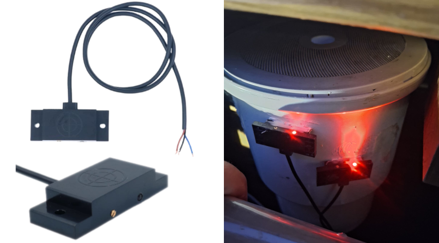
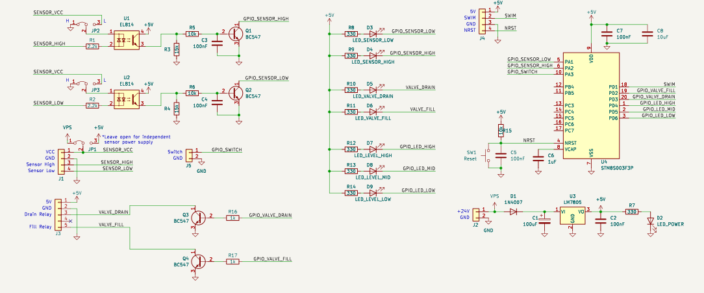
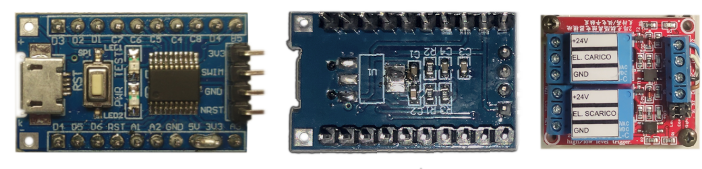
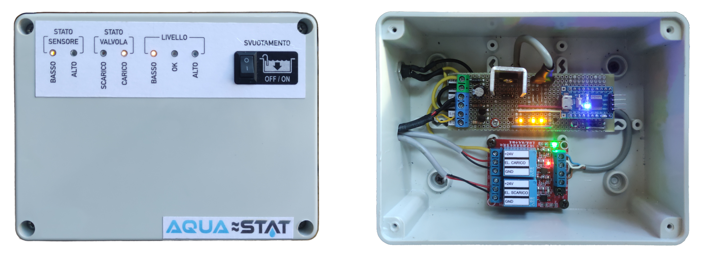

<!-- TOC -->

---

Automatic Water Level Controller based on STM8 MCU.

<!-- TOC start -->
- [Overview](#overview)
- [Level Sensors](#level-sensors)
- [Tuning](#tuning)
- [Schematic](#schematic)
- [Hardware](#hardware)
- [Enclosure and Front Panel](#enclosure-and-front-panel)
- [FSM Logic](#fsm-logic)
    * [System Status LED Indicators](#system-status-led-indicators)
- [Firmware Architecture](#firmware-architecture)
    * [Portability](#portability)
- [Building](#building)
<!-- TOC end -->

<!-- TOC -->
## Overview
Aqua ≈ Stat is a water level controller designed for swimming pools and water tanks. 

It utilizes two external capacitive sensors to monitor the upper and lower limits, ensuring complete electrical isolation by avoiding direct contact with the water. The optimal water level is reached using calibrated dead-reckoning timers.

The entire control logic runs on an ultra-low-cost 8-bit STM8 microcontroller.

<!-- TOC -->
## Level Sensors

Capacitive sensors are preferable because they avoid direct contact between the electronics and the water, preventing electrical hazards or corrosion. However, other sensors like standard mechanical float switches can also be used to detect the water level.

Each sensor features a trimmer to adjust its sensitivity. They must be calibrated to ensure the output (indicated by the built-in LED on the sensor) reliably toggles when water is detected.

The two sensors must be placed far enough apart to prevent excessively frequent fill and drain cycles.

<!-- TOC -->
## Tuning
The configuration file located at [`firmware/include/config.h`](firmware/include/config.h) contains the parameters that must be tuned for the system to operate correctly. 

Since the system does not use a third middle sensor, the optimal level is reached by timing the drain and fill cycles after crossing a sensor threshold.

* **`T_FILL_MS`**: Time required for the water level to rise from the low sensor to the ideal setpoint (halfway between the two sensors).
* **`T_DRAIN_MS`**: Time required for the water level to fall from the high sensor to the ideal setpoint.
* **`T_WAIT_MS`**: Cooldown time enforced when an overshoot occurs (e.g., the water reaches the high sensor while the fill timer is still running). It prevents rapid, infinite fill/drain loops.
* **`T_SENSOR_DEBOUNCE_MS`**: Debounce filter duration (typically 3-5 seconds). It reduces system reactivity, making it immune to false triggers caused by water ripples or minor fluctuations on the sensor surface.

<!-- TOC -->
## Schematic

<!-- TOC -->
## Hardware
The prototype circuit is built on a perfboard; currently, there are no plans to design a dedicated PCB.

For the MCU, a low-cost STM8S003F3P6 breakout board is used. The onboard LDO voltage regulator is removed to allow the microcontroller to be powered directly at 5V from the main circuit.

The system drives a standard 2-relay module to control the load (solenoid valves or pumps). The board's jumpers must be set to "L" (Low-Level Trigger) so the channels activate when the BJT driver outputs are pulled to ground.

If the system is powered by a high voltage supply (e.g., 24V), it is highly recommended to use a DC-DC step-down converter instead of a classic LM7805 linear regulator. The current drawn by a single active relay is enough to significantly heat up a linear regulator, requiring a bulky heatsink. Alternatively, you can choose a relay board with a coil voltage that matches the main power supply, bypassing the 5V regulator entirely for the heavy load, just ensure the relay board's optoisolators or logic inputs can still be safely triggered by the 5V logic of the STM8.

<!-- TOC -->
## Enclosure and Front Panel
The electronics are housed in a waterproof outdoor junction box.

To display the system status on the front panel without compromising the enclosure's waterproof rating, the light emitted by the 7 SMD LEDs soldered on the perfboard is guided to the outside using 1.7mm optical fiber strands.

The front panel graphics were designed in Inkscape, printed on a standard A4 sheet, laminated with wide transparent tape for weather resistance, and attached to the box using double-sided tape. 

To allow the optical fibers to pass cleanly through the laminated paper sheet, a custom mini hole punch was made by sharpening the edges of a small steel tube using a drill and files.

<!-- TOC -->
## FSM Logic
The algorithm is powered by a Finite State Machine (FSM) that manages the water cycle through the following states:

* **Startup** (`RESET_STATE`): Upon power-up, the system waits on standby until the sensor readings pass the debounce filter. If the water level is already between the two sensors at startup, it assumes the optimal state (`IDLE_STATE`).

* **Filling** (`FILL_STATE` & `FILL_TIMER_STATE`): If the water drops below the lower sensor, the fill relay is activated. When the level rises above the lower sensor, a timer starts and continues filling until the ideal level is reached.

* **Draining** (`DRAIN_STATE` & `DRAIN_TIMER_STATE`): If the water rises above the upper sensor, the drain relay is activated. When the level drops below the upper sensor, a timer starts and continues draining until the ideal level is reached.

* **Anti-Loop Protection** (`WAIT_HIGH_STATE` & `WAIT_LOW_STATE`): If the upper sensor is triggered during the timed filling phase (overshoot), the system enters a blocking wait state to prevent an infinite fill/drain loop. If this occurs, the physical distance between the sensors must be increased, or the timer parameters in the code must be reduced. The same logic applies during the draining phase. 

* **Hardware Error** (`ERROR_STATE`): If the system detects the upper sensor as active and the lower one as inactive, it identifies a physical paradox or hardware fault. It immediately locks the relays and enters an error state. The FSM automatically recovers only when the readings become physically plausible again.

* **Manual Override** (`MANUAL_DRAIN_STATE`): Activating a physical switch bypasses the entire FSM logic, forcibly keeping the drain relay active to completely empty the pool for maintenance.

<!-- TOC -->
### System Status LED Indicators

|  | FSM State | Description |
|--------------------------------|-----------|-------------|
|  | `DRAIN_STATE` | Level is above the high sensor. Drain valve is active. |
|  | `DRAIN_TIMER_STATE` | Level dropped below the high sensor. Timed drain to reach setpoint. |
|  | `IDLE_STATE` | Target level reached. Water is stable between the two sensors. |
|  | `FILL_TIMER_STATE` | Level rose above the low sensor. Timed fill to reach setpoint. |
|  | `FILL_STATE` | Level is below the low sensor. Fill valve is active. |
|  | `MANUAL_DRAIN_STATE` | Manual override switch is closed. Drain valve is active. |
|  | `ERROR_STATE` | Hardware fault: High sensor is active while low sensor is not. |
|  | `RESET_STATE` | Booting / Waiting for the first valid sensor reading. |
|  | `WAIT_LOW_STATE` | Dropped below low sensor during drain. Cooldown to prevent looping. |
|  | `WAIT_HIGH_STATE` | Rose above high sensor during fill. Cooldown to prevent looping. |

<!-- TOC -->
## Firmware Architecture
The firmware is organized into the following components:

* [**`config.h`**](firmware/include/config.h): System configuration parameters. Timing parameters and FSM configuration.
* [**`pin_map.h`**](firmware/include/pin_map.h): Hardware GPIO definitions and mapping.
* [**`fsm.h`**](firmware/src/fsm.h): The core Finite State Machine logic.
* [**`sensors_debouncer.h`**](firmware/src/sensors_debouncer.h): A combined software debouncer for the two level sensors.
* [**`systick.h`**](firmware/src/systick.h): Hardware timer implementation to emulate the standard `millis()` function for time-tracking.
* [**`stm8s_conf.h`**](firmware/src/stm8s_conf.h): Peripheral library configuration (optimized to include only the strictly necessary drivers to reduce flash memory footprint).
* [**`main.c`**](firmware/src/main.c): Main execution loop, hardware initialization, GPIO assignments, and FSM ticking.

<!-- TOC -->
### Portability
While this firmware was explicitly developed in C for the STM8S003 on PlatformIO, the core logic is hardware-agnostic and easily portable to other 8-bit (e.g., Arduino/ATmega328P) or 32-bit (e.g., STM32) microcontrollers. 

To port the project:
* The `systick.h` module can be entirely omitted (or bypassed) if your target framework already provides a native `millis()` function (such as the Arduino core). 
* The FSM logic remains untouched. You will only need to adapt the hardware-specific GPIO reads and writes to match your chosen microcontroller.
* The structure of `main.c` must be adapted to the execution model of the target framework. For example, if you are using the Arduino core, the standard C `main()` function and its infinite `while(1)` loop must be split into the standard `setup()` and `loop()` functions

<!-- TOC -->
## Building
To compile and flash the project:

1. Open the [`firmware`](firmware) folder using the [**PlatformIO**](https://platformio.org/) extension in Visual Studio Code.
2. Install the STM8 platform framework when prompted by PlatformIO (if not already installed).
3. Adjust the system timing and configuration parameters inside [`config.h`](firmware/include/config.h).
4. Connect an [ST-Link](https://www.st.com/en/development-tools/st-link-v2.html) programmer to the STM8 SWIM interface and click **Upload** to flash the firmware.
